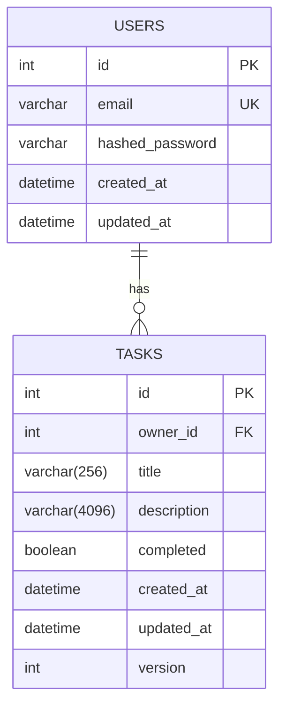

# Data Model: Full-Stack Todo Application

This document provides a detailed description of the database schema, including tables, columns, data types, relationships, and constraints. This model is based on the entities defined in `spec.md` and the clarifications from the planning phase.

## Schema Diagram

## Table Definitions

### 1. `users`

Stores user account information.

| Column Name       | Data Type         | Constraints                               | Description                                      |
|-------------------|-------------------|-------------------------------------------|--------------------------------------------------|
| `id`              | `INTEGER`         | `PRIMARY KEY`, `AUTO_INCREMENT`           | Unique identifier for the user.                  |
| `email`           | `VARCHAR(255)`    | `UNIQUE`, `NOT NULL`                      | User's email address, used for login.            |
| `hashed_password` | `VARCHAR(255)`    | `NOT NULL`                                | User's salted and hashed password.               |
| `created_at`      | `TIMESTAMP WITH TIME ZONE` | `NOT NULL`, `DEFAULT NOW()`    | Timestamp of when the user account was created.  |
| `updated_at`      | `TIMESTAMP WITH TIME ZONE` | `NOT NULL`, `DEFAULT NOW()`    | Timestamp of the last update to the user record. |

**Indexes**:
- A unique index is automatically created on the `email` column.
- A primary key index is automatically created on the `id` column.

---

### 2. `tasks`

Stores the individual to-do items for each user.

| Column Name   | Data Type         | Constraints                             | Description                                                                 |
|---------------|-------------------|-----------------------------------------|-----------------------------------------------------------------------------|
| `id`          | `INTEGER`         | `PRIMARY KEY`, `AUTO_INCREMENT`         | Unique identifier for the task.                                             |
| `owner_id`    | `INTEGER`         | `NOT NULL`, `FOREIGN KEY (users.id)`    | The ID of the user who owns this task. Ensures user data isolation.         |
| `title`       | `VARCHAR(256)`    | `NOT NULL`                              | The title of the task.                                                      |
| `description` | `VARCHAR(4096)`   | `NULLABLE`                              | A more detailed description of the task.                                    |
| `completed`   | `BOOLEAN`         | `NOT NULL`, `DEFAULT FALSE`             | The completion status of the task.                                          |
| `created_at`  | `TIMESTAMP WITH TIME ZONE` | `NOT NULL`, `DEFAULT NOW()`  | Timestamp of when the task was created.                                     |
| `updated_at`  | `TIMESTAMP WITH TIME ZONE` | `NOT NULL`, `DEFAULT NOW()`  | Timestamp of the last update to the task. Used for optimistic concurrency. |
| `version`     | `INTEGER`         | `NOT NULL`, `DEFAULT 1`                 | A version number that increments on each update, for optimistic locking.    |

**Indexes**:
- A primary key index is automatically created on the `id` column.
- **`idx_tasks_owner_id`**: A non-unique index should be created on the `owner_id` column to speed up queries for a user's tasks.
- **`idx_tasks_completed`**: A non-unique index could be created on the `completed` column if filtering by completion status is a very frequent operation.

## Relationships

- **`USERS` to `TASKS`**: A one-to-many relationship. One user can have many tasks, but each task belongs to exactly one user. This is enforced by the `owner_id` foreign key.

## Data Integrity and Constraints

- **User Data Isolation**: The `owner_id` in the `tasks` table is the critical component for ensuring a user can only ever access their own data. All API queries for tasks MUST include a `WHERE owner_id = :current_user_id` clause.
- **Field Lengths**: The `VARCHAR` limits on `title` and `description` will be enforced at the database level as a final guard against oversized data, complementing the application-level validation.
- **Optimistic Concurrency Control**: The `version` column (or `updated_at` timestamp) will be used to prevent lost updates. When a client submits an update, it must provide the version number of the record it started editing. The `UPDATE` statement will then check if the current version in the database matches the one provided by the client.
