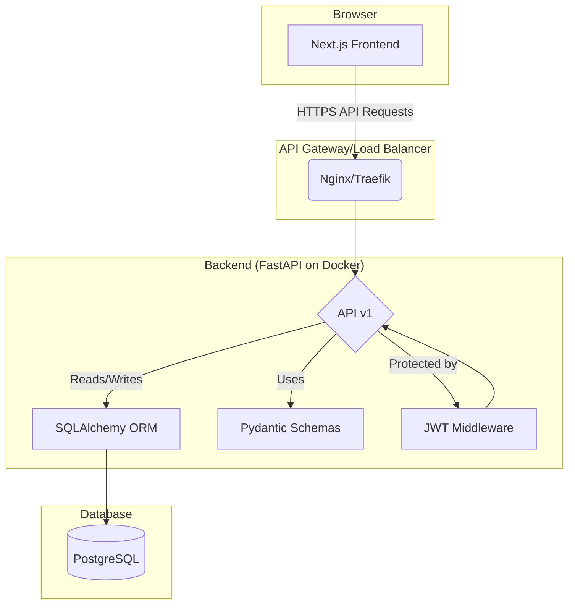
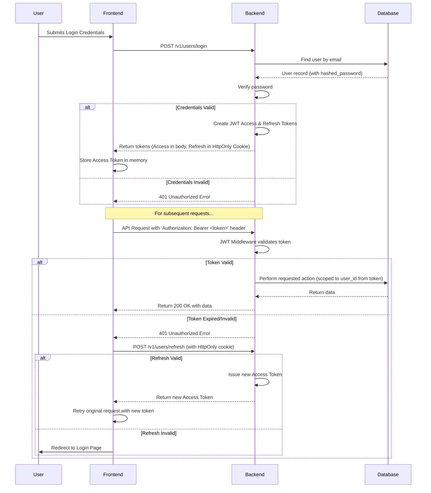

# Implementation Plan: Full-Stack Todo Web Application

**Branch**: `001-fullstack-todo-app` | **Date**: 2025-12-07 | **Spec**: [specs/001-fullstack-todo-app/spec.md](./spec.md)
**Input**: Feature specification from `specs/001-fullstack-todo-app/spec.md`

## Summary

This plan outlines the architecture and design for a full-stack, monorepo Todo web application. The technical approach involves a Next.js frontend, a FastAPI backend, a PostgreSQL database, and JWT-based authentication. The system will be containerized using Docker. This plan is based on the detailed requirements and clarifications in the feature specification and adheres to the project constitution.

## Technical Context

**Language/Version**: Python 3.11+, TypeScript (Next.js 16+)
**Primary Dependencies**: FastAPI, Next.js, SQLAlchemy, Alembic, Pydantic, Passlib
**Storage**: PostgreSQL (Neon)
**Testing**: Pytest, Jest/React Testing Library
**Target Platform**: Dockerized services for Linux server environment
**Project Type**: Monorepo with distinct frontend and backend web applications.
**Performance Goals**: 95% of API requests < 200ms; Lighthouse score > 85.
**Constraints**: JWT Authentication, User Data Isolation, Responsive UI.
**Scale/Scope**: Initial version designed to support thousands of users, with a focus on establishing a scalable foundation.

## Constitution Check

*GATE: Must pass before proceeding with implementation.*

- [x] **Code Quality**: The plan specifies `mypy` for the backend and TypeScript for the frontend, with defined error handling and testing strategies (`pytest`, `Jest`).
- [x] **API Design**: The API will be RESTful, using standard status codes, Pydantic for validation, and consistent JSON responses as detailed in the generated OpenAPI contract.
- [x] **Security**: The plan mandates JWT validation middleware, user data isolation in all queries, and `passlib` for password hashing.
- [x] **Database**: The plan includes a detailed schema in `data-model.md`, specifies `Alembic` for migrations, and notes the need for indexing.
- [x] **Frontend**: The plan outlines a component-based structure, suggests a centralized state management solution, and references accessibility and responsiveness requirements from the spec.
- [x] **Documentation**: The plan relies on FastAPI's auto-generated OpenAPI docs, TSDoc for components, and requires a comprehensive `README.md`.
- [x] **Git Workflow**: The project will follow Conventional Commits and a feature-branch PR process as per the constitution.

## Project Structure

### Documentation (this feature)

```text
specs/001-fullstack-todo-app/
├── plan.md              # This file
├── research.md          # Research on DB choices, integration patterns
├── data-model.md        # Detailed database schema
├── quickstart.md        # Local setup and run instructions
├── contracts/           # OpenAPI specification
│   └── openapi.yaml
└── tasks.md             # To be created by /sp.tasks
```

### Source Code (repository root)
```text
# Full-Stack Application Structure
backend/
├── app/
│   ├── __init__.py
│   ├── main.py
│   ├── api/
│   │   ├── __init__.py
│   │   └── v1/
│   │       ├── __init__.py
│   │       ├── endpoints/
│   │       └── schemas/
│   ├── core/
│   │   ├── __init__.py
│   │   ├── config.py
│   │   └── security.py
│   ├── db/
│   │   ├── __init__.py
│   │   ├── base.py
│   │   └── session.py
│   └── services/
│       ├── __init__.py
└── tests/
    ├── __init__.py
    ├── conftest.py
    └── api/
        └── v1/

frontend/
├── src/
│   ├── app/
│   ├── components/
│   │   ├── shared/
│   │   └── ui/
│   ├── hooks/
│   ├── lib/
│   ├── pages/
│   └── services/
└── tests/

docker-compose.yml
```

**Structure Decision**: The project will adopt a monorepo structure with a `backend` directory for the FastAPI application and a `frontend` directory for the Next.js application, orchestrated by Docker Compose. This aligns with the constitution and provides a clear separation of concerns.

## Architectural Diagrams

### Backend Architecture



### Authentication Flow



## Complexity Tracking

No violations of the constitution are proposed in this plan. Therefore, this section is not applicable.