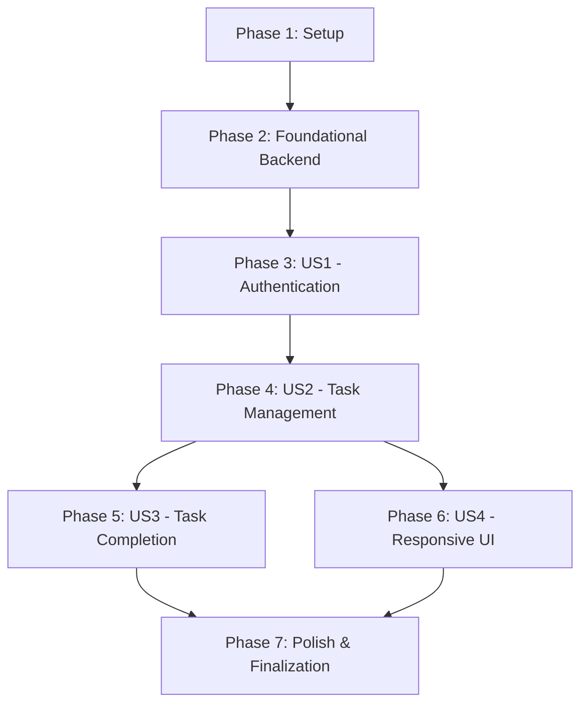

# Tasks: Full-Stack Todo Web Application

This document breaks down the implementation of the "Full-Stack Todo Web Application" feature into actionable, dependency-ordered tasks. Each phase, especially those tied to user stories, is designed to be an independently testable increment.

## Implementation Strategy

The implementation will follow an MVP-first approach. The initial focus will be on completing User Story 1 (Authentication), which provides the foundational security layer. User Story 2 (Task Management) will be implemented next as it contains the core application functionality. Subsequent user stories will be implemented incrementally. This allows for early end-to-end testing and iterative delivery.

**Suggested MVP Scope**: Complete Phase 1, Phase 2, and Phase 3 (User Story 1). This delivers a secure, runnable application skeleton with user registration and login capabilities.

## Dependency Graph

The following graph shows the high-level dependency order for completing the user stories.

---

## Phase 1: Setup & Infrastructure
**Goal**: Initialize the monorepo structure and configure the local development environment.
**Independent Test**: A developer can clone the repo and run `docker-compose up` to start all services without errors.

- [x] T001 Create the monorepo directory structure: `backend/` and `frontend/`.
- [x] T002 Create the `docker-compose.yml` file defining the `backend`, `frontend`, and `db` services.
- [ ] T003 Create a root `.gitignore` file with appropriate ignores for Python, Node.js, and IDE files.
- [ ] T004 Create and document the `backend/.env` file for local development environment variables.
- [ ] T005 Initialize Alembic for database migrations in `backend/alembic/`.

---

## Phase 2: Foundational Backend
**Goal**: Establish the core FastAPI application, database connectivity, and security primitives.
**Independent Test**: The backend service runs, connects to the database, and the `/docs` endpoint is accessible.

- [ ] T006 Set up the main FastAPI application in `backend/app/main.py`.
- [ ] T007 Implement database session management in `backend/app/db/session.py`.
- [ ] T008 [P] Implement core configuration settings in `backend/app/core/config.py`.
- [ ] T009 [P] Implement JWT token creation and validation helpers in `backend/app/core/security.py`.
- [ ] T010 Implement a reusable JWT bearer token dependency in `backend/app/api/dependencies.py`.

---

## Phase 3: User Story 1 - Authentication
**Goal**: As a user, I can create an account and sign in securely.
**Independent Test**: A user can register, log in, and receive a JWT. API endpoints are protected.

- [ ] T011 [US1] Implement the `User` SQLAlchemy model in `backend/app/db/models/user.py`.
- [ ] T012 [US1] Create the first Alembic migration script for the `users` table.
- [ ] T013 [US1] Implement the `POST /v1/users/register` endpoint in `backend/app/api/v1/endpoints/auth.py`.
- [ ] T014 [US1] Implement the `POST /v1/users/login` endpoint in `backend/app/api/v1/endpoints/auth.py`.
- [ ] T015 [P] [US1] Initialize the Next.js project in the `frontend/` directory.
- [ ] T016 [P] [US1] Set up Tailwind CSS for styling in `frontend/`.
- [ ] T017 [US1] Create a shared API client wrapper in `frontend/src/lib/api.ts` to handle requests.
- [ ] T018 [US1] Create the authentication pages (e.g., `(auth)/login/page.tsx`, `(auth)/signup/page.tsx`) in `frontend/src/app/`.
- **Integration Checkpoint**:
- [ ] T019 [US1] Connect frontend forms to the backend register and login endpoints and test the full authentication flow.

---

## Phase 4: User Story 2 - Task Management (CRUD)
**Goal**: As an authenticated user, I can create, read, update, and delete my tasks.
**Independent Test**: A logged-in user can perform all CRUD operations on their tasks.

- [ ] T020 [US2] Implement the `Task` SQLAlchemy model in `backend/app/db/models/task.py`.
- [ ] T021 [US2] Create a new Alembic migration script for the `tasks` table.
- [ ] T022 [P] [US2] Implement `POST /v1/tasks` (create) endpoint in `backend/app/api/v1/endpoints/tasks.py`.
- [ ] T023 [P] [US2] Implement `GET /v1/tasks` (list) endpoint in `backend/app/api/v1/endpoints/tasks.py`.
- [ ] T024 [P] [US2] Implement `PUT /v1/tasks/{task_id}` (update) endpoint in `backend/app/api/v1/endpoints/tasks.py`.
- [ ] T025 [P] [US2] Implement `DELETE /v1/tasks/{task_id}` (delete) endpoint in `backend/app/api/v1/endpoints/tasks.py`.
- [ ] T026 [US2] Create the main dashboard layout in `frontend/src/app/dashboard/layout.tsx`.
- [ ] T027 [US2] Build the `TaskForm` component in `frontend/src/components/tasks/TaskForm.tsx`.
- [ ] T028 [US2] Build the `TaskList` and `TaskItem` components in `frontend/src/components/tasks/TaskList.tsx`.
- **Integration Checkpoint**:
- [ ] T029 [US2] Integrate the frontend components to fetch and display tasks, and to create, edit, and delete tasks using the API client.

---

## Phase 5: User Story 3 - Task Completion
**Goal**: As a user, I can mark tasks as complete or incomplete.
**Independent Test**: A user can click a checkbox on a task, and its state is updated and visually changed.

- [ ] T030 [US3] Add a `PATCH /v1/tasks/{task_id}` endpoint for toggling completion status in `backend/app/api/v1/endpoints/tasks.py`.
- [ ] T031 [US3] Implement the completion toggle functionality in the `TaskItem` component in `frontend/src/components/tasks/TaskList.tsx`.
- **Integration Checkpoint**:
- [ ] T032 [US3] Verify that clicking the toggle updates the task's state on the backend and the UI reflects the change.

---

## Phase 6: User Story 4 - Responsive UI
**Goal**: As a user, I can use the application on both mobile and desktop.
**Independent Test**: The application is usable and looks good on screen widths from 360px to 1280px.

- [ ] T033 [US4] Apply responsive Tailwind CSS classes to the main layout, authentication pages, and dashboard components.
- [ ] T034 [US4] Test and adjust the UI on various screen sizes using browser developer tools.

---

## Phase 7: Polish & Cross-Cutting Concerns
**Goal**: Finalize documentation, error handling, and other non-functional requirements.
**Independent Test**: The project `README.md` is up-to-date, and API errors are handled gracefully on the frontend.

- [ ] T035 Implement standardized error message display on the frontend based on the API's error envelope.
- [ ] T036 [P] Add integration tests to verify user data isolation.
- [ ] T037 [P] Ensure all API endpoints have comprehensive descriptions for auto-generated documentation in `backend/app/api/v1/endpoints/`.
- [ ] T038 Update the root `README.md` with final setup instructions and an overview of the project architecture.
